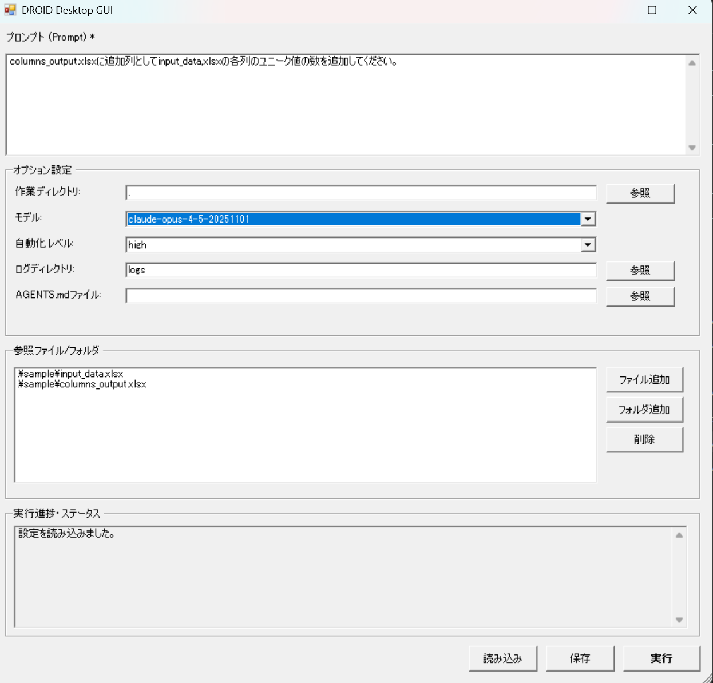

# DROID Desktop GUI & PowerShell Tools

[Factory.ai](https://www.factory.ai/)の[DROID](https://www.factory.ai/droid)を簡単に使用するためのWindows Desktop GUIツールです。

## 🎨 WPF版 Desktop GUI（NEW! モダンデザイン）

**ModernWpf を使用したモダンな WPF GUI**

### 起動方法
```cmd
run-droid-wpf.bat
```

### 特徴
- ✅ **モダンなデザイン**: [ModernWpf](https://github.com/Kinnara/ModernWpf) ライブラリによる現代的なUI
- ✅ WPF による高度なグラフィカル操作
- ✅ プロンプトとパラメータを直感的に入力
- ✅ ファイル/フォルダの参照が簡単
- ✅ AGENTS.mdファイルの指定が可能
- ✅ 実行状態のリアルタイム表示
- ✅ 実行進捗のリアルタイム表示

### 必須環境
- Windows 10/11
- [.NET 8.0 SDK](https://dotnet.microsoft.com/download/dotnet/8.0) 以上
- [Factory.ai DROID](https://www.factory.ai/droid)

### 詳細
詳しい使い方は [DroidWpfGui/README.md](DroidWpfGui/README.md) をご覧ください。

## Desktop GUI（Windows Forms版）

**Windows標準のPowerShell Windows Forms GUI**



### 起動方法
```cmd
run-droid.bat
```

### 特徴
- ✅ Windows標準搭載のコンポーネントを使用
- ✅ グラフィカルな操作画面
- ✅ プロンプトとパラメータを直感的に入力
- ✅ ファイル/フォルダの参照が簡単
- ✅ AGENTS.mdファイルの指定が可能
- ✅ 実行状態のリアルタイム表示
- ✅ **実行進捗のリアルタイム表示（NEW!）**

### 必須環境
- Windows PowerShell（Windows標準搭載）
- [Factory.ai DROID](https://www.factory.ai/droid)

### 詳細
詳しい使い方は [GUI使用方法.md](docs/GUI使用方法.md) をご覧ください。

## PowerShell/JSON方式（従来方式）

**JSONファイルを編集してコマンドラインから実行**

## ファイル構成

```
Droid/
├── run-droid-wpf.bat          # WPF GUI起動用バッチファイル（NEW!）
├── run-droid.bat              # Windows Forms GUI起動用バッチファイル
├── DroidWpfGui/               # WPF GUIプロジェクト（NEW!）
│   ├── DroidWpfGui.csproj    # C# プロジェクトファイル
│   ├── App.xaml              # アプリケーション定義
│   ├── MainWindow.xaml       # メインウィンドウUI
│   └── README.md             # WPF GUI詳細ドキュメント
├── gui_droid_winforms.ps1     # Windows Forms GUIアプリケーション
├── gui_droid.py               # Python版GUI（レガシー）
├── invoke-droid.ps1           # PowerShellスクリプト
├── prompt.json                # プロンプト設定ファイル
├── docs/
│   ├── GUI使用方法.md        # GUI使用ガイド
│   ├── GUI仕様書.md          # GUI仕様書
│   └── images/               # 画像ファイル
└── README.md                  # このファイル
```

## 使い方（PowerShell/JSON方式）

### 1. prompt.jsonにプロンプトを記述（JSON方式の場合）

```json
{
    "prompt": "ここにDROIDへの指示を書く",
    "options": {
        "working_directory": "."
    }
}
```

### 2. PowerShellから直接実行（JSON方式の場合）

JSONを編集後、PowerShellから直接実行する場合：

```cmd
powershell -NoProfile -ExecutionPolicy Bypass -File invoke-droid.ps1
```

## prompt.jsonの設定

| プロパティ | 説明 | 例 |
|-----------|------|-----|
| `prompt` | DROIDへの指示内容 | `"このコードをレビューして"` |
| `options.working_directory` | 作業ディレクトリ（相対パスまたは���対パス） | `"."` または `"C:/projects/myapp"` |
| `options.reference_paths` | 参照ファイル/フォルダパスの配列 | `[
    "src/main.py",
    "docs/"
]` |
| `options.model` | 使用するAIモデル | `"claude-sonnet-4-20250514"`, `"claude-opus-4-20250514"` |
| `options.auto_approve` | ファイル変更を自動承認するか | `true` または `false` |
| `options.log_directory` | ログ出力先ディレクトリ | `"logs"` または `"C:/logs/droid"` |
| `options.mcp_server` | MCPサーバーコマンド（外部ツール連携） | `"npx @anthropic/mcp-server-filesystem"` |

### prompt.jsonの完全な例

```json
{
    "prompt": "このプロジェクトのコードをレビューして改善点を教えて",
    "options": {
        "working_directory": "C:/projects/myapp",
        "reference_paths": [
            "src/main.py",
            "src/utils/",
            "config.json"
        ],
        "model": "claude-sonnet-4-20250514",
        "auto_approve": false,
        "log_directory": "logs",
        "mcp_server": "npx @anthropic/mcp-server-filesystem"
    }
}
```

## ログ出力機能

実行するたびに`logs`フォルダ（またはlog_directoryで指定したフォルダ）にログファイルが自動生成されます。

### ログに含まれる内容
- 実行日時
- プロンプト内容
- 作業ディレクトリ
- 使用モデル
- **DROIDの検討過程（思考プロセス）**
- 実行結果
- 完了時刻

### ログファイル名
```
droid_YYYYMMDD_HHMMSS.log
```
例: `droid_20260110_143052.log`

## プロンプトの例

### ファイル操作
```json
{
    "prompt": "このフォルダ内のファイル一覧を表示して",
    "options": { "working_directory": "." }
}
```

### コード作成
```json
{
    "prompt": "Pythonで簡単なTODOリストアプリを作成して",
    "options": { "working_directory": "." }
}
```

### プロジェクト分析
```json
{
    "prompt": "このプロジェクトの構造を説明して",
    "options": { "working_directory": "C:/path/to/your/project" }
}
```

### バグ修正
```json
{
    "prompt": "main.pyのエラーを修正して",
    "options": { "working_directory": "." }
}
```

### リファクタリング
```json
{
    "prompt": "utils.jsのコードを読みやすくリファクタリングして",
    "options": { "working_directory": "." }
}
```

## 前提条件

- [Factory.ai](https://www.factory.ai/)の[DROID](https://www.factory.ai/droid)がインストールされていること
- `droid`コマンドがPATHに通っていること

## トラブルシューティング

### 「droidコマンドが見つからない」エラー
→ DROIDが正しくインストールされているか、PATHが設定されているか確認してください。

### 「prompt.jsonが見つからない」エラー
→ prompt.jsonがinvoke-droid.ps1と同じフォルダにあるか確認してください。

### 文字化けする場合
→ prompt.jsonをUTF-8で保存してください。
